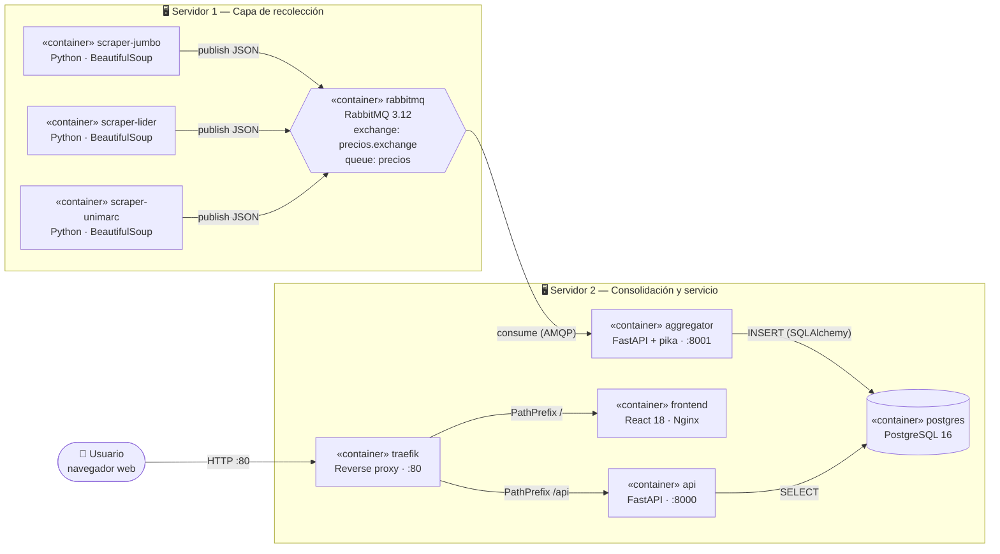
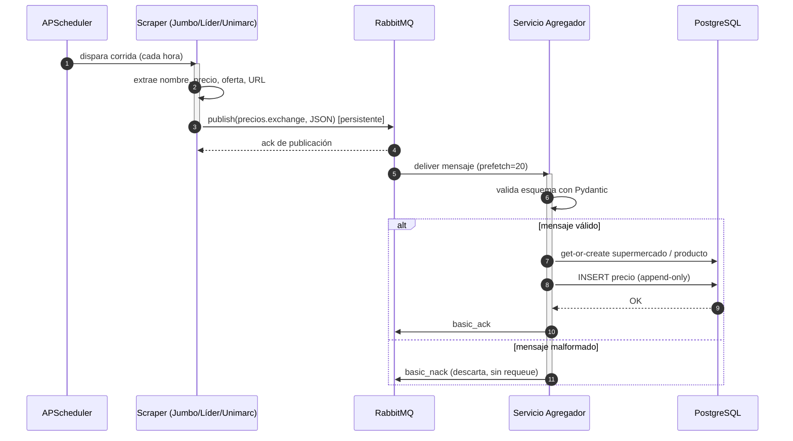
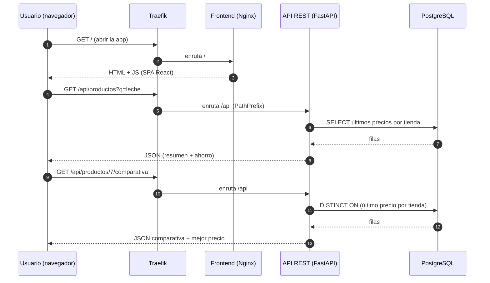
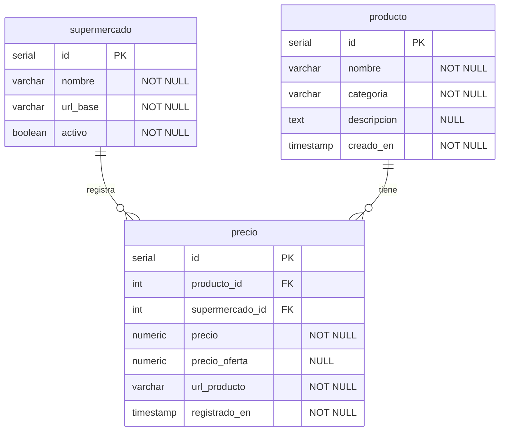

# 🛒 SuperTracker

**Sistema distribuido para la comparación de precios en supermercados de Chile**
(Jumbo · Líder · Unimarc)

> Asignatura **INFO288 — Sistemas Distribuidos** · Universidad Austral de Chile
> Iteración 2 — Implementación de las funcionalidades principales.

SuperTracker recolecta automáticamente los precios de las principales cadenas de
supermercados, los consolida en una base de datos central y los expone mediante
una API REST y una interfaz web donde el usuario puede **buscar un producto,
comparar su precio entre tiendas y consultar el historial de variaciones**.

La comunicación entre componentes sigue el patrón **Publicador/Suscriptor** sobre
un broker de mensajes (RabbitMQ), lo que desacopla la recolección de la
consolidación y permite escalar cada parte de forma independiente.

---

## 📑 Tabla de contenidos

- [Funcionalidades implementadas](#-funcionalidades-implementadas)
- [Arquitectura](#-arquitectura)
  - [Vista de despliegue y contenedores](#vista-de-despliegue-y-contenedores)
  - [Diagrama de secuencia — ingesta de precios](#diagrama-de-secuencia--ingesta-de-precios)
  - [Diagrama de secuencia — consulta del usuario](#diagrama-de-secuencia--consulta-del-usuario)
  - [Modelo relacional (diagrama ER)](#modelo-relacional-diagrama-er)
- [Stack tecnológico](#-stack-tecnológico)
- [Despliegue](#-despliegue)
  - [Requisitos](#requisitos)
  - [Puesta en marcha](#puesta-en-marcha)
  - [Variables de entorno](#-variables-de-entorno)
- [API REST](#-api-rest)
- [Estructura del repositorio](#-estructura-del-repositorio)
- [Modos de scraping (mock / real)](#-modos-de-scraping-mock--real)
- [Documentación adicional](#-documentación-adicional)
- [Autores](#-autores)

---

## ✅ Funcionalidades implementadas

Todas las funcionalidades principales (no relacionadas con seguridad) declaradas
en el documento de diseño:

| # | Funcionalidad | Componente |
|---|---------------|------------|
| 1 | Recolección periódica de precios por tienda (cada hora) | scrapers + APScheduler |
| 2 | Publicación asíncrona de precios vía cola de mensajes | RabbitMQ (Pub/Sub) |
| 3 | Consumo, validación y persistencia de los precios | servicio agregador |
| 4 | Almacenamiento con **historial completo** (marca temporal por registro) | PostgreSQL |
| 5 | Búsqueda de productos por nombre y por categoría | API REST |
| 6 | **Comparación** del precio entre las tres tiendas | API REST + frontend |
| 7 | **Historial** de variación de precios con gráfico | API REST + frontend |
| 8 | Cálculo del supermercado más barato y del ahorro potencial | API REST |
| 9 | Estadísticas globales del sistema | API REST |
| 10 | Interfaz web responsive (escritorio y móvil) | React 18 |
| 11 | Enrutamiento unificado por reverse proxy / API gateway | Traefik |

---

## 🏗️ Arquitectura

El sistema combina el modelo **cliente–servidor** con el patrón
**Publicador/Suscriptor**. Los scrapers actúan como *productores*, RabbitMQ como
*broker* que desacopla, y el agregador como *consumidor* que persiste. La API y
el frontend conforman la capa cliente–servidor de lectura.

### Vista de despliegue y contenedores

Cada caja `«container»` es un contenedor Docker independiente. Los subgrafos
reflejan el **modelo físico de dos servidores** definido en el diseño.



> 🔎 **Notación.** El estereotipo `«container»` indica un componente
> desplegado como contenedor Docker (vista de componentes/despliegue UML). El
> diagrama de componentes formal y su explicación detallada están en
> [`docs/ARCHITECTURE.md`](docs/ARCHITECTURE.md).

### Diagrama de secuencia — ingesta de precios

Flujo asíncrono desde que un scraper extrae un precio hasta que queda
persistido. RabbitMQ garantiza la entrega aunque el agregador esté caído.



### Diagrama de secuencia — consulta del usuario

Flujo síncrono cliente–servidor cuando el usuario compara un producto.



### Modelo relacional (diagrama ER)

Tres tablas. `precio` es **append-only**: cada lectura inserta una fila nueva con
su marca temporal, lo que habilita el historial.



El diccionario de datos completo (con índices y descripciones) está en
[`docs/ARCHITECTURE.md`](docs/ARCHITECTURE.md#8-diccionario-de-datos).

---

## 🧩 Stack tecnológico

| Componente | Tecnología | Versión | Rol |
|------------|-----------|---------|-----|
| Scrapers | Python · requests · BeautifulSoup | 3.11 / 2.32 / 4.12 | Extraen precios de cada sitio |
| Scheduler | APScheduler | 3.10 | Dispara los scrapers cada hora |
| Broker | RabbitMQ | 3.12 | Cola de mensajes Pub/Sub |
| Cliente AMQP | pika | 1.3 | Publicar / consumir mensajes |
| Agregador | FastAPI · SQLAlchemy | 0.110 / 2.0 | Consume la cola y persiste |
| Base de datos | PostgreSQL | 16 | Persistencia con historial |
| API REST | FastAPI · Uvicorn | 0.110 / 0.29 | Expone los datos al frontend |
| Validación | Pydantic | 2.7 | Esquemas de mensajes y respuestas |
| Frontend | React · Vite · Recharts | 18 / 5 / 2 | Búsqueda, comparación y gráficos |
| Servidor web | Nginx | 1.27 | Sirve la SPA y reenvía /api |
| Reverse proxy | Traefik | 2.11 | API gateway (puertos 80/443) |
| Contenedores | Docker · Docker Compose | 26 / 2.26 | Empaquetado y orquestación |

---

## 🚀 Despliegue

### Requisitos

- **Docker** ≥ 24 y **Docker Compose** ≥ 2.20 (`docker compose`, plugin v2).
- Puertos libres en el host: **80** (web), **8080** (dashboard Traefik) y
  **15672** (consola RabbitMQ). Son configurables por variables de entorno.
- No se requiere instalar Python, Node ni PostgreSQL: todo corre en contenedores.

### Puesta en marcha

```bash
# 1. Clonar el repositorio
git clone https://github.com/uach-info288/supertracker.git
cd supertracker

# 2. Crear el archivo de configuración a partir de la plantilla
cp .env.example .env        # opcional: editar credenciales/puertos

# 3. Construir e iniciar todo el sistema
docker compose up --build
```

Al terminar el arranque (las imágenes se construyen la primera vez):

| Servicio | URL |
|----------|-----|
| 🌐 **Aplicación web** | <http://localhost> |
| ❤️ Salud de la API | <http://localhost/api/health> |
| 🐇 Consola RabbitMQ | <http://localhost:15672> (usuario/clave del `.env`) |
| 🚦 Dashboard Traefik | <http://localhost:8080> |

Con `SCRAPER_MODE=mock` y `RUN_ON_STARTUP=true` (valores por defecto), los
scrapers publican datos de inmediato: en segundos la web ya muestra productos.

```bash
# Ver logs de un servicio concreto
docker compose logs -f aggregator

# Detener y conservar los datos
docker compose down

# Detener y BORRAR los datos (volúmenes)
docker compose down -v
```

> 💡 Para una demo rápida con historial visible, baja el intervalo:
> `SCRAPE_INTERVAL_MINUTES=2` en el `.env` antes de `docker compose up`.

### 🔧 Variables de entorno

Todas se definen en `.env` (plantilla en [`.env.example`](.env.example)). Tienen
valores por defecto, de modo que el sistema arranca sin configurar nada.

| Variable | Usada por | Significado | Default |
|----------|-----------|-------------|---------|
| `RABBITMQ_USER` | rabbitmq, scrapers, aggregator | Usuario del broker de mensajes | `supertracker` |
| `RABBITMQ_PASSWORD` | rabbitmq, scrapers, aggregator | Contraseña del broker | `supertracker` |
| `PRICES_QUEUE` | scrapers, aggregator | Nombre de la cola de precios | `precios` |
| `PRICES_EXCHANGE` | scrapers, aggregator | Nombre del exchange Pub/Sub | `precios.exchange` |
| `PRICES_ROUTING_KEY` | scrapers, aggregator | Routing key de los mensajes | `precios.nuevo` |
| `RABBITMQ_MGMT_PORT` | host | Puerto de la consola de administración | `15672` |
| `POSTGRES_USER` | postgres, aggregator, api | Usuario de la base de datos | `supertracker` |
| `POSTGRES_PASSWORD` | postgres, aggregator, api | Contraseña de la base de datos | `supertracker` |
| `POSTGRES_DB` | postgres, aggregator, api | Nombre de la base de datos | `supertracker` |
| `SCRAPER_MODE` | scrapers | `mock` (sintético) o `real` (HTTP real) | `mock` |
| `SCRAPE_INTERVAL_MINUTES` | scrapers | Minutos entre corridas de scraping | `60` |
| `RUN_ON_STARTUP` | scrapers | Ejecutar una corrida al iniciar | `true` |
| `MAX_PRODUCTS_PER_STORE` | scrapers | Tope de productos por tienda y corrida | `500` |
| `SCRAPER_DELAY_SECONDS` | scrapers | Espera entre peticiones HTTP (modo real) | `1.5` |
| `PREFETCH_COUNT` | aggregator | Mensajes sin ACK que recibe el agregador (QoS) | `20` |
| `CORS_ORIGINS` | api | Orígenes permitidos por CORS | `*` |
| `DEFAULT_PAGE_SIZE` | api | Tamaño de página por defecto | `20` |
| `MAX_PAGE_SIZE` | api | Tamaño de página máximo | `100` |
| `HTTP_PORT` | host (traefik) | Puerto público de la aplicación | `80` |
| `TRAEFIK_DASHBOARD_PORT` | host (traefik) | Puerto del dashboard de Traefik | `8080` |

---

## 🔌 API REST

Base: `/api` (a través de Traefik en `http://localhost`). Documentación
interactiva autogenerada por FastAPI en `/docs` del contenedor `api`.

| Método | Ruta | Descripción |
|--------|------|-------------|
| `GET` | `/api/health` | Estado del servicio |
| `GET` | `/api/stats` | Métricas globales (totales y última actualización) |
| `GET` | `/api/supermercados` | Lista de cadenas registradas |
| `GET` | `/api/categorias` | Categorías disponibles para filtrar |
| `GET` | `/api/productos?q=&categoria=&page=&page_size=` | Búsqueda paginada con resumen de precios |
| `GET` | `/api/productos/{id}` | Datos básicos de un producto |
| `GET` | `/api/productos/{id}/comparativa` | Último precio en cada tienda + mejor precio |
| `GET` | `/api/productos/{id}/historial?dias=30` | Historial de precios en la ventana indicada |

Ejemplo:

```bash
curl "http://localhost/api/productos?q=leche&page=1&page_size=5"
```

---

## 📂 Estructura del repositorio

```
supertracker/
├── docker-compose.yml         # Orquestación de todo el sistema
├── .env.example               # Plantilla de variables de entorno
├── README.md
├── db/
│   └── init/01_schema.sql      # Esquema + seed (se carga al crear la BD)
├── scrapers/                   # Productores (Servidor 1)
│   ├── shared/                 # Config, contrato de mensaje, catálogo, publisher
│   ├── base_scraper.py         # Lógica común (modo mock / real)
│   ├── jumbo_scraper.py
│   ├── lider_scraper.py
│   ├── unimarc_scraper.py
│   ├── scheduler.py            # APScheduler
│   └── Dockerfile
├── aggregator/                 # Consumidor (Servidor 2)
│   ├── app/                    # consumer, repository, models, schemas
│   ├── main.py                 # Consumidor + servidor de salud
│   └── Dockerfile
├── api/                        # API REST (Servidor 2)
│   ├── app/                    # routers, crud, models, schemas
│   ├── main.py
│   └── Dockerfile
├── frontend/                   # SPA React (Servidor 2)
│   ├── src/                    # App, componentes, api.js
│   ├── nginx.conf
│   └── Dockerfile
└── docs/                       # Documentación de diseño y decisiones
    ├── ARCHITECTURE.md
    ├── PRESUPUESTO.md
    ├── ESCALABILIDAD.md
    └── MEJORAS_ITERACION2.md
```

---

## 🕸️ Modos de scraping (mock / real)

Los scrapers soportan dos modos, controlados por `SCRAPER_MODE`:

- **`mock` (por defecto).** Genera precios sintéticos a partir de un catálogo
  semilla de productos chilenos reales, con variación por tienda. Es una
  **decisión de diseño deliberada**: garantiza un demo reproducible de extremo a
  extremo (scraper → cola → agregador → BD → API → web) sin depender de la
  estructura HTML —que cambia con frecuencia— ni de los sistemas anti-bot de los
  sitios reales. Ideal para evaluar la arquitectura distribuida.
- **`real`.** Realiza peticiones HTTP reales con `requests` + `BeautifulSoup`,
  respetando *delays* y un `User-Agent` identificable. Sujeto a que los sitios
  permitan el scraping y a que sus selectores CSS no hayan cambiado.

En ambos modos el resto del sistema es idéntico: lo que cambia es únicamente la
fuente de los precios. Esto se detalla en
[`docs/MEJORAS_ITERACION2.md`](docs/MEJORAS_ITERACION2.md).

---

## 📚 Documentación adicional

| Documento | Contenido |
|-----------|-----------|
| [`docs/ARCHITECTURE.md`](docs/ARCHITECTURE.md) | Explicación detallada de cada componente, diagrama de componentes UML y diccionario de datos |
| [`docs/PRESUPUESTO.md`](docs/PRESUPUESTO.md) | Presupuesto del proyecto (hardware, energía, software) |
| [`docs/ESCALABILIDAD.md`](docs/ESCALABILIDAD.md) | Componentes escalables, estrategia, límites actuales y métricas |
| [`docs/MEJORAS_ITERACION2.md`](docs/MEJORAS_ITERACION2.md) | Mejoras introducidas respecto a la Iteración 1 |

---

## 👥 Autores

Eduardo Leal · Benjamín Martínez · Luis Olivares · Ninoska Toledo
Universidad Austral de Chile — Facultad de Ciencias de la Ingeniería.
