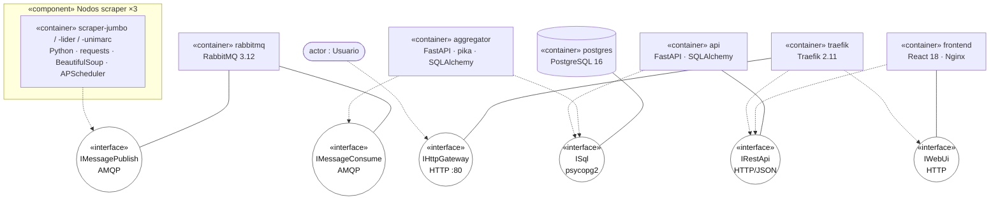
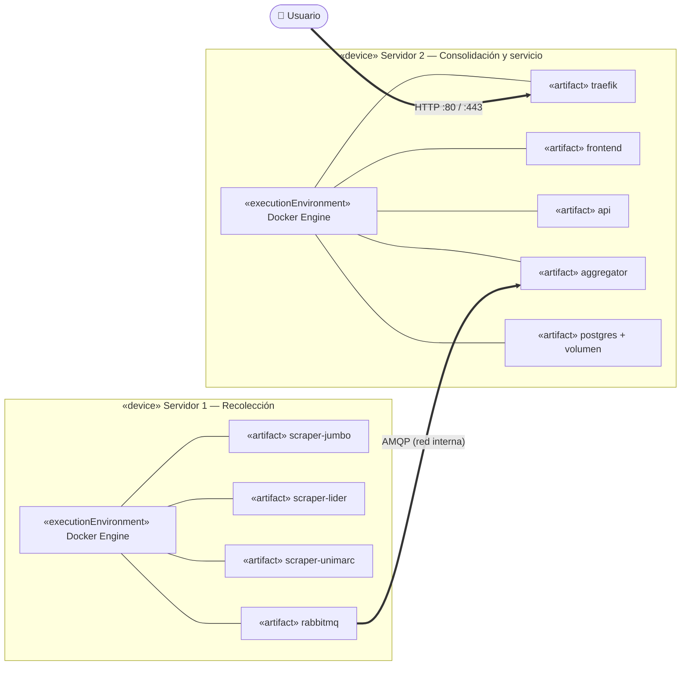
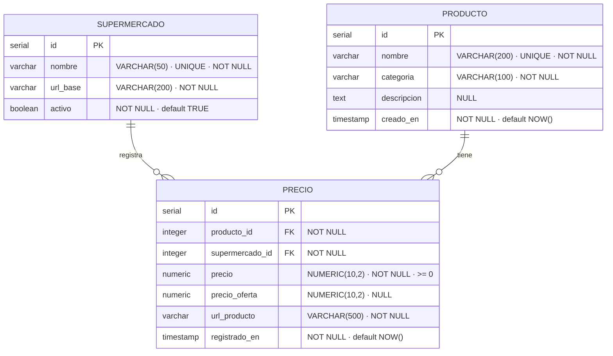

# Arquitectura de SuperTracker

> Documento de arquitectura de la **Iteración 2**. Profundiza la sección 3 del
> documento de diseño y corrige las observaciones de la Iteración 1:
> diagrama de componentes en **notación UML**, **diagrama de base de datos**,
> presencia explícita de los **contenedores Docker** en los diagramas y
> **explicación detallada de cada pieza**.

## Índice

- [1. Visión general](#1-visión-general)
- [2. Modelo arquitectónico](#2-modelo-arquitectónico)
- [3. Diagrama de componentes (UML)](#3-diagrama-de-componentes-uml)
  - [3.1 Notación utilizada](#31-notación-utilizada)
  - [3.2 Contratos de interfaz](#32-contratos-de-interfaz)
- [4. Explicación detallada de cada componente](#4-explicación-detallada-de-cada-componente)
- [5. Modelo de despliegue físico](#5-modelo-de-despliegue-físico)
- [6. Contrato de mensajes (RabbitMQ)](#6-contrato-de-mensajes-rabbitmq)
- [7. Modelo relacional](#7-modelo-relacional)
- [8. Diccionario de datos](#8-diccionario-de-datos)

---

## 1. Visión general

SuperTracker es un sistema distribuido que **recolecta, consolida y publica**
precios de las cadenas de supermercados chilenas Jumbo, Líder y Unimarc. El
sistema desacopla la *recolección* (scrapers) de la *consolidación* (agregador)
mediante un broker de mensajes, y separa la *escritura* (agregador → base de
datos) de la *lectura* (API → frontend). Esta separación es la que permite
escalar cada parte de forma independiente (ver
[`ESCALABILIDAD.md`](ESCALABILIDAD.md)).

Todos los componentes —excepto los volúmenes de datos— se ejecutan como
**contenedores Docker** orquestados con Docker Compose, distribuidos sobre dos
servidores físicos.

---

## 2. Modelo arquitectónico

El sistema combina dos estilos arquitectónicos clásicos:

| Estilo | Dónde se aplica | Qué aporta |
|--------|-----------------|------------|
| **Publicador/Suscriptor** (sobre cola de mensajes) | scrapers → RabbitMQ → agregador | Desacopla productores de consumidor; tolera caídas transitorias sin perder mensajes; permite añadir scrapers o consumidores sin tocar el resto |
| **Cliente–servidor** (multinivel) | usuario → Traefik → frontend/API → base de datos | Capa de presentación (React), capa de servicio (FastAPI), capa de datos (PostgreSQL), con un *reverse proxy* como punto de entrada único |

Los roles del modelo Pub/Sub son:

- **Productores** — cada scraper genera mensajes JSON con precios y los publica
  en el *exchange* sin conocer quién los consume.
- **Broker** — RabbitMQ recibe los mensajes en un *exchange* de tipo `direct`,
  los enruta a la cola `precios` (durable) y los conserva hasta que un consumidor
  los confirma (`ack`).
- **Consumidor** — el servicio agregador se suscribe a la cola, valida cada
  mensaje con Pydantic y lo persiste en PostgreSQL.

---

## 3. Diagrama de componentes (UML)

El siguiente diagrama de componentes usa notación UML 2.x: cada componente lleva
el estereotipo `«component»` (o `«container»` cuando además es una unidad de
despliegue Docker), y las dependencias se expresan mediante **interfaces
proporcionadas y requeridas** (notación *ball-and-socket*). Las interfaces se
dibujan como nodos circulares `( )`: una flecha continua desde un componente
hacia la interfaz indica que **la proporciona**; una flecha discontinua desde un
componente hacia la interfaz indica que **la requiere**.



### 3.1 Notación utilizada

| Símbolo | Significado UML |
|---------|-----------------|
| `«component»` | Componente lógico de software |
| `«container»` | Componente desplegado como contenedor Docker (artefacto de despliegue) |
| `«interface»` `( )` | Interfaz (punto de contrato entre componentes) |
| Flecha **continua** componente → interfaz | Interfaz **proporcionada** (*provided*, "bola") |
| Flecha **discontinua** componente → interfaz | Interfaz **requerida** (*required*, "socket") |
| `actor` | Actor externo (usuario humano) |

> En herramientas UML completas (StarUML, draw.io, PlantUML) las interfaces
> proporcionadas se dibujan como un círculo relleno (bola) y las requeridas como
> un semicírculo (socket) que encaja en la bola. Mermaid no soporta el símbolo
> ball-and-socket nativo, por lo que se emula con nodos circulares y el tipo de
> línea (continua = proporciona, discontinua = requiere). La semántica es
> idéntica.

### 3.2 Contratos de interfaz

Cada dependencia entre componentes está mediada por una interfaz explícita. Esto
hace que los componentes sean intercambiables mientras respeten el contrato.

| Interfaz | La proporciona | La requieren | Protocolo / contrato |
|----------|----------------|--------------|----------------------|
| `IMessagePublish` | rabbitmq | scrapers | AMQP 0-9-1. Publicación al exchange `precios.exchange` (tipo `direct`, routing key `precios`) con mensajes JSON persistentes |
| `IMessageConsume` | rabbitmq | aggregator | AMQP 0-9-1. Consumo de la cola `precios` (durable) con `ack` manual y `prefetch` configurable |
| `ISql` | postgres | aggregator, api | Protocolo PostgreSQL vía `psycopg2`. El agregador **escribe**; la API solo **lee** |
| `IRestApi` | api | frontend, traefik | HTTP/JSON. Endpoints REST bajo el prefijo `/api` (ver [API REST](../README.md#-api-rest)) |
| `IWebUi` | frontend | traefik | HTTP. Sirve la SPA de React (HTML/JS/CSS estáticos) vía Nginx |
| `IHttpGateway` | traefik | usuario | HTTP en el puerto 80. Punto de entrada único; enruta por `PathPrefix` |

---

## 4. Explicación detallada de cada componente

### 4.1 Scrapers (`scraper-jumbo`, `scraper-lider`, `scraper-unimarc`)

**Rol.** Productores del patrón Pub/Sub. Hay un contenedor por cadena, todos
construidos a partir de una misma imagen base parametrizada por la variable
`STORE`.

**Funcionamiento interno.**
1. **APScheduler** (incluido en el propio contenedor) dispara una corrida cada
   `SCRAPE_INTERVAL_MINUTES` (60 por defecto). Opcionalmente ejecuta una corrida
   al arrancar si `RUN_ON_STARTUP=true`.
2. La clase `BaseScraper` define el flujo común (obtener catálogo, normalizar,
   publicar) y las subclases `JumboScraper`, `LiderScraper`, `UnimarcScraper`
   especializan la extracción.
3. Cada producto extraído se transforma en un mensaje JSON (ver
   [contrato de mensajes](#6-contrato-de-mensajes-rabbitmq)) y se publica vía
   `pika` en el exchange `precios.exchange`.

**Dos modos de operación** (variable `SCRAPER_MODE`):
- `mock` (por defecto): genera precios sintéticos a partir de un catálogo semilla
  determinista. Permite una demostración end-to-end reproducible sin depender de
  la disponibilidad ni de la estructura HTML de los sitios reales.
- `real`: realiza scraping HTTP real con `requests` + `BeautifulSoup`, con
  `SCRAPER_DELAY_SECONDS` entre peticiones y un *User-Agent* válido (scraping
  responsable).

**Por qué es así.** Independencia total: un scraper puede fallar sin afectar a
los demás ni al agregador. Añadir Santa Isabel o Tottus es crear un nuevo
contenedor que publica en la misma cola, sin tocar el resto del sistema.

### 4.2 Broker de mensajes (`rabbitmq`)

**Rol.** Componente central que desacopla productores y consumidor.

**Funcionamiento.** Declara un *exchange* `direct` llamado `precios.exchange` y
una cola **durable** `precios` enlazada con la routing key `precios`. Los
mensajes se publican como **persistentes**, de modo que sobreviven a un reinicio
del broker. El agregador confirma cada mensaje con `ack` solo después de
persistirlo; si el agregador cae antes del `ack`, RabbitMQ vuelve a entregar el
mensaje (entrega *at-least-once*).

**Por qué es así.** Garantiza que ningún precio se pierda ante caídas
transitorias del agregador y habilita el patrón *competing consumers* (varios
agregadores leyendo la misma cola) para escalar el consumo.

### 4.3 Servicio Agregador (`aggregator`)

**Rol.** Consumidor (suscriptor) del Pub/Sub y único componente con permiso de
**escritura** sobre la base de datos.

**Funcionamiento interno.**
1. Se suscribe a la cola `precios` con `pika`.
2. Valida cada mensaje con un esquema **Pydantic** (`IncomingPrice`). Los
   mensajes mal formados se descartan sin tumbar el consumidor.
3. Resuelve el producto y el supermercado con una operación **get-or-create
   idempotente** (`INSERT ... ON CONFLICT DO NOTHING`), de modo que varios
   agregadores en paralelo nunca generan duplicados.
4. Inserta una fila nueva en `precio` (modelo *append-only* → historial).
5. Confirma el mensaje (`ack`).

Además expone un pequeño servidor **FastAPI** en un hilo en segundo plano
(puerto `AGGREGATOR_HEALTH_PORT`, 8001) con endpoints de *health* y métricas
para monitoreo.

**Por qué es así.** Centralizar la escritura en un único tipo de componente
mantiene la lógica de consolidación en un solo lugar y la idempotencia permite
escalarlo horizontalmente sin condiciones de carrera.

### 4.4 API REST (`api`)

**Rol.** Capa de servicio de **solo lectura** que el frontend consulta.

**Funcionamiento.** Servicio **FastAPI** independiente del agregador. Lee de
PostgreSQL mediante SQLAlchemy y expone los endpoints bajo `/api`: salud,
estadísticas, listado de supermercados y categorías, búsqueda paginada de
productos, comparativa de precios entre tiendas e historial de variaciones. CORS
está restringido a métodos `GET`.

**Por qué es así.** Separar lectura (API) de escritura (agregador) permite
escalar cada flujo de forma independiente: se pueden levantar múltiples réplicas
de la API tras Traefik sin afectar a la ingesta de datos.

### 4.5 Frontend (`frontend`)

**Rol.** Capa de presentación.

**Funcionamiento.** SPA en **React 18** (build con Vite) servida como estáticos
por **Nginx**. Permite buscar productos, ver la comparativa entre tiendas y
graficar el historial (Recharts). El diseño es *responsive*. Nginx también
puede reenviar `/api` como respaldo.

**Por qué es así.** Al ser estáticos y sin estado, el frontend se replica y se
cachea trivialmente.

### 4.6 Reverse proxy / API Gateway (`traefik`)

**Rol.** Punto de entrada único del sistema.

**Funcionamiento.** **Traefik 2.11** escucha en el puerto 80 y enruta por
`PathPrefix`: `/api` → servicio `api` (prioridad alta) y `/` → servicio
`frontend` (prioridad baja). Descubre los servicios automáticamente mediante las
*labels* de Docker.

**Por qué es así.** Unifica el acceso bajo un solo origen (evita problemas de
CORS para el usuario), oculta la topología interna y actúa como balanceador
cuando un servicio tiene varias réplicas.

### 4.7 Base de datos (`postgres`)

**Rol.** Almacenamiento centralizado y persistente.

**Funcionamiento.** **PostgreSQL 16** con tres tablas (`supermercado`,
`producto`, `precio`). La tabla `precio` es *append-only*: cada lectura de
scraping inserta una fila nueva con su marca temporal, lo que constituye el
**historial**. El esquema se crea automáticamente en el primer arranque
(`db/init/01_schema.sql`) e incluye índices para búsqueda y consultas históricas.

**Por qué es así.** Un modelo append-only es la forma más simple y robusta de
conservar historial completo sin lógica de versionado adicional.

---

## 5. Modelo de despliegue físico

La infraestructura contempla **dos servidores físicos** (8 cores, 16 GB RAM,
500 GB SSD, Ubuntu 22.04 LTS cada uno):



- **Servidor 1 (capa de recolección):** los tres scrapers + APScheduler y el
  broker RabbitMQ.
- **Servidor 2 (consolidación y servicio):** agregador, API REST, PostgreSQL 16,
  frontend (Nginx) y Traefik.
- La comunicación entre servidores usa la **red interna** de la organización.
  El Servidor 2 expone hacia Internet únicamente los puertos **80** y **443**.

> En el `docker-compose.yml` de esta entrega, los nueve servicios se ejecutan en
> conjunto para facilitar la evaluación, pero las **redes Docker** (`collection`,
> `backbone`, `data`, `edge`) están definidas reflejando esta separación física,
> de modo que el despliegue en dos servidores es un cambio de configuración, no
> de arquitectura.

---

## 6. Contrato de mensajes (RabbitMQ)

Mensaje JSON publicado por los scrapers y consumido por el agregador. El campo
`categoria` se **incorporó en la Iteración 2** (ver
[`MEJORAS_ITERACION2.md`](MEJORAS_ITERACION2.md)) para poblar `producto.categoria`
(que es `NOT NULL`); es retro-compatible y toma el valor `"general"` si falta.

| Campo | Tipo | Obligatorio | Descripción |
|-------|------|:-----------:|-------------|
| `scraper_id` | string | sí | Identificador del scraper que originó el mensaje |
| `supermercado` | string | sí | Nombre de la cadena (`Jumbo` / `Líder` / `Unimarc`) |
| `nombre_producto` | string | sí | Nombre del producto scrapeado |
| `categoria` | string | no | Categoría del producto (por defecto `general`) |
| `precio` | number | sí | Precio en CLP al momento del scraping |
| `precio_oferta` | number \| null | no | Precio con descuento si existe; `null` si no hay oferta |
| `url_producto` | string | sí | URL directa al producto en el sitio |
| `timestamp` | string | sí | Marca temporal ISO 8601 del momento del scraping |

Ejemplo:

```json
{
  "scraper_id": "scraper-jumbo",
  "supermercado": "Jumbo",
  "nombre_producto": "Leche entera 1L Soprole",
  "categoria": "lácteo",
  "precio": 1290.0,
  "precio_oferta": 990.0,
  "url_producto": "https://www.jumbo.cl/leche-entera-1l-soprole",
  "timestamp": "2026-05-29T14:03:21Z"
}
```

---

## 7. Modelo relacional



**Cardinalidades.** Un `supermercado` y un `producto` tienen, cada uno, **cero o
muchos** registros en `precio`. Cada fila de `precio` referencia **exactamente
un** producto y **un** supermercado. Como `precio` es *append-only*, la
combinación (`producto_id`, `supermercado_id`) aparece tantas veces como lecturas
se hayan tomado: ahí reside el historial.

**Índices** (definidos en `db/init/01_schema.sql`):
`idx_producto_nombre`, `idx_producto_categoria`, `idx_precio_producto`,
`idx_precio_supermercado`, `idx_precio_registrado_en` y el compuesto
`idx_precio_prod_super_fecha (producto_id, supermercado_id, registrado_en DESC)`
que acelera la consulta "último precio por producto y tienda".

---

## 8. Diccionario de datos

Esquema completo, fiel al archivo `diccionario_datos.xlsx` del diseño.

### Tabla `supermercado`
Cadenas de supermercado monitorizadas (una fila por cadena).

| Campo | Tipo | Restricción | Clave | Descripción |
|-------|------|-------------|:-----:|-------------|
| `id` | `SERIAL` | NOT NULL | PK | Identificador único del supermercado |
| `nombre` | `VARCHAR(50)` | NOT NULL, UNIQUE | | Nombre de la cadena (Jumbo, Líder, Unimarc) |
| `url_base` | `VARCHAR(200)` | NOT NULL | | URL raíz del sitio web a scrapear |
| `activo` | `BOOLEAN` | NOT NULL, default TRUE | | Indica si el scraper de esta cadena está activo |

### Tabla `producto`
Catálogo unificado de productos. El `nombre` es la clave natural con que el
agregador deduplica un producto entre cadenas.

| Campo | Tipo | Restricción | Clave | Descripción |
|-------|------|-------------|:-----:|-------------|
| `id` | `SERIAL` | NOT NULL | PK | Identificador único del producto |
| `nombre` | `VARCHAR(200)` | NOT NULL, UNIQUE | | Nombre del producto tal como aparece en el sitio |
| `categoria` | `VARCHAR(100)` | NOT NULL | | Categoría del producto (lácteo, bebida, higiene, etc.) |
| `descripcion` | `TEXT` | NULL | | Descripción adicional del producto |
| `creado_en` | `TIMESTAMP` | NOT NULL, default NOW() | | Fecha/hora del primer registro del producto |

### Tabla `precio`
Historial *append-only* de precios (una fila por lectura de scraping).

| Campo | Tipo | Restricción | Clave | Descripción |
|-------|------|-------------|:-----:|-------------|
| `id` | `SERIAL` | NOT NULL | PK | Identificador único del registro de precio |
| `producto_id` | `INTEGER` | NOT NULL | FK → `producto.id` | Referencia al producto |
| `supermercado_id` | `INTEGER` | NOT NULL | FK → `supermercado.id` | Referencia al supermercado |
| `precio` | `NUMERIC(10,2)` | NOT NULL, ≥ 0 | | Precio en CLP al momento del scraping |
| `precio_oferta` | `NUMERIC(10,2)` | NULL, ≥ 0 | | Precio con descuento si existe; NULL si no hay oferta |
| `url_producto` | `VARCHAR(500)` | NOT NULL | | URL directa al producto en el sitio |
| `registrado_en` | `TIMESTAMP` | NOT NULL, default NOW() | | Fecha/hora en que se registró este precio |
