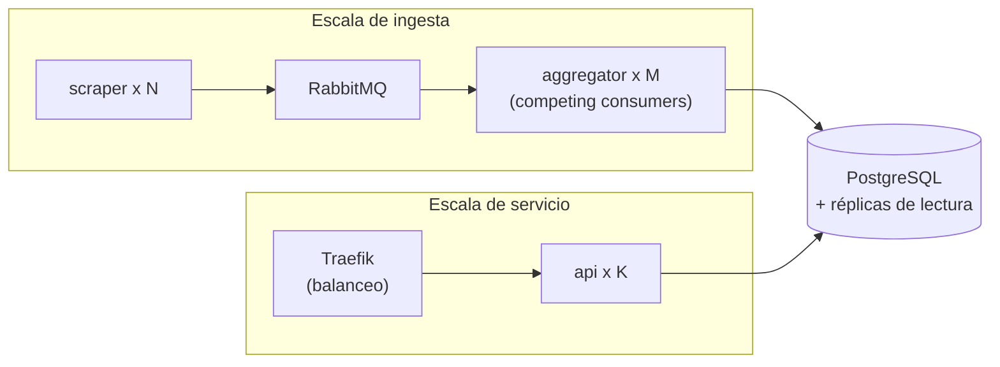

# Escalabilidad — SuperTracker

> Corrige la observación de la Iteración 1: faltaba detallar **qué componentes
> escalan, cómo escalan, cuáles son los límites actuales y con qué métricas se
> mide la escalabilidad**. Este documento responde esos cuatro puntos.

## 1. Principio general

La arquitectura Pub/Sub + cliente-servidor está diseñada para escalar
**horizontalmente** (añadiendo réplicas) en lugar de solo verticalmente (máquinas
más grandes). El desacople vía RabbitMQ y la separación lectura/escritura son lo
que lo hacen posible: cada flujo se puede replicar sin afectar a los demás.

---

## 2. Componentes escalables

| Componente | ¿Escala? | Estrategia | Mecanismo concreto |
|------------|:--------:|------------|--------------------|
| **Scrapers** | ✅ Horizontal | Una réplica por cadena; particionado por catálogo | Añadir un contenedor con otra `STORE`, o dividir el catálogo de una cadena entre varias instancias |
| **RabbitMQ** | ✅ Horizontal | Clustering + colas espejadas / quorum | Nodos adicionales en clúster; *sharding* por exchange si crece el volumen |
| **Agregador** | ✅ Horizontal | *Competing consumers* sobre la misma cola | Levantar M réplicas; RabbitMQ reparte mensajes; la escritura es idempotente (`ON CONFLICT`), sin duplicados |
| **API REST** | ✅ Horizontal | Réplicas sin estado tras el proxy | K réplicas; Traefik balancea por las *labels* de Docker |
| **Frontend** | ✅ Horizontal | Estáticos replicables + caché/CDN | Varias réplicas Nginx; cacheable en CDN |
| **Traefik** | ✅ Horizontal | Varias instancias tras DNS round-robin / LB | Útil sobre todo para alta disponibilidad |
| **PostgreSQL** | ⚠️ Mixto | Vertical + réplicas de **lectura** | Escritura en el primario (la limita el agregador); lecturas escalables con réplicas; *sharding* por tienda/categoría si crece mucho |

El **único componente que no escala trivialmente en escritura** es PostgreSQL: la
ingesta converge a un primario. En cambio las **lecturas** (que es donde está la
mayor parta del tráfico de usuarios) sí escalan con réplicas de solo lectura, lo
que encaja con que la API ya es de solo lectura.

---

## 3. Cómo se escala cada flujo

### 3.1 Flujo de ingesta (escritura)

1. **Más cadenas** → un contenedor scraper más, publicando en la misma cola.
2. **Una cadena muy grande** → particionar su catálogo (p. ej. por categoría) en
   varias instancias del mismo scraper.
3. **Cola creciendo** (el agregador no da abasto) → añadir réplicas del agregador
   como *competing consumers*. RabbitMQ reparte los mensajes automáticamente y la
   idempotencia evita duplicados.
4. **Broker saturado** → pasar RabbitMQ a clúster con colas *quorum*.

### 3.2 Flujo de servicio (lectura)

1. **Más usuarios concurrentes** → más réplicas de la API tras Traefik.
2. **Lecturas pesadas a la BD** → réplicas de lectura de PostgreSQL; la API
   apunta a ellas.
3. **Carga de estáticos** → más réplicas del frontend y/o CDN.

---

## 4. Límites actuales (Iteración 2)

Configuración de esta entrega: 2 servidores, 1 réplica por componente, scraping
cada hora, modo `mock` para la demo.

| Dimensión | Límite estimado actual | Factor limitante |
|-----------|------------------------|------------------|
| Productos monitorizados | ≈ **1.500** | Tiempo de una corrida de scraping dentro de la ventana horaria |
| Cadenas de supermercado | 3 (Jumbo, Líder, Unimarc) | Alcance de la Iteración 1 |
| Frecuencia de actualización | 1 corrida / **hora** / cadena | `SCRAPE_INTERVAL_MINUTES` |
| Usuarios web concurrentes | ≈ **50** | 1 réplica de API + 1 de frontend |
| Throughput de ingesta | ≈ **50–100 msg/s** sostenidos | 1 réplica de agregador + escritura a un primario |
| Almacenamiento de historial | Limitado por los 500 GB del SSD | Crecimiento append-only de `precio` |
| Servidores | 2 | Despliegue físico definido en el diseño |

> Estos límites se superan con las estrategias de la sección 3 **sin rediseñar**
> el sistema: son límites de *configuración*, no de *arquitectura*.

---

## 5. Métricas de escalabilidad

Indicadores con los que se mide si el sistema necesita escalar y si escala bien.

### 5.1 Métricas de ingesta (RabbitMQ + agregador)

| Métrica | Qué indica | Umbral de alerta |
|---------|------------|------------------|
| **Profundidad de cola** (`precios` queue depth) | Mensajes esperando consumo | Crecimiento sostenido ⇒ añadir agregadores |
| **Tasa de consumo** (msg/s `ack`) | Capacidad real del agregador | Cae por debajo de la tasa de publicación ⇒ saturación |
| **Latencia de ingesta** (publish → persistido) | Frescura del dato | > pocos segundos ⇒ revisar agregador/BD |
| **Tasa de mensajes rechazados** (validación Pydantic) | Calidad de los scrapers | Pico ⇒ un sitio cambió su HTML |
| **Duración de una corrida de scraping** | Margen dentro de la ventana horaria | Se acerca a 60 min ⇒ particionar catálogo |

El agregador expone estas métricas en su endpoint de salud
(`AGGREGATOR_HEALTH_PORT`, 8001).

### 5.2 Métricas de servicio (API + frontend)

| Métrica | Qué indica | Umbral de alerta |
|---------|------------|------------------|
| **Throughput de la API** (req/s) | Demanda de lectura | Cerca del máximo por réplica ⇒ añadir réplicas |
| **Latencia p95/p99 de la API** | Experiencia de usuario | p95 > 300–500 ms ⇒ escalar API o BD |
| **Tasa de errores HTTP 5xx** | Salud del servicio | > 1% ⇒ investigar |
| **Uso de conexiones a PostgreSQL** | Saturación del *pool* | Cerca del máximo ⇒ réplicas de lectura / pooling |
| **Usuarios concurrentes** | Carga real | Cerca de ~50 ⇒ escalar horizontalmente |

### 5.3 Métricas de recursos (infraestructura)

CPU, memoria, I/O de disco y red por contenedor y por servidor. Se monitorean con
las métricas del propio Docker / del sistema operativo.

### 5.4 Métricas de evaluación de la escalabilidad

Para *demostrar* que el sistema escala (no solo operarlo):

- **Speedup de ingesta:** throughput con M agregadores ÷ throughput con 1. Ideal
  ≈ lineal hasta que el primario de PostgreSQL se vuelve el cuello de botella.
- **Eficiencia:** speedup ÷ número de réplicas (cuánto se aprovecha cada
  réplica añadida).
- **Escalabilidad de lectura:** req/s soportadas con K réplicas de API
  manteniendo p95 bajo un umbral.

---

## 6. Conclusión

Seis de los siete tipos de componente escalan **horizontalmente** sin cambios de
diseño; PostgreSQL escala en lectura con réplicas y, en escritura, mediante
*sharding* si llegara a ser necesario. Los límites actuales (~1.500 productos,
~50 usuarios concurrentes, scraping horario, 2 servidores) son límites de la
**configuración** elegida para la Iteración 2, y las métricas de la sección 5
indican con precisión cuándo y cómo conviene escalar cada flujo.
